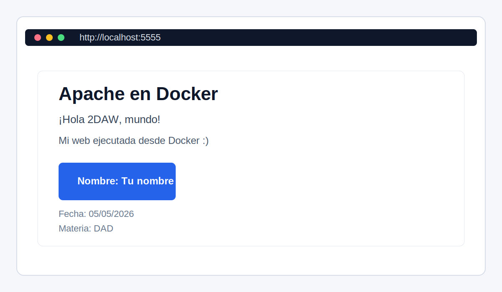
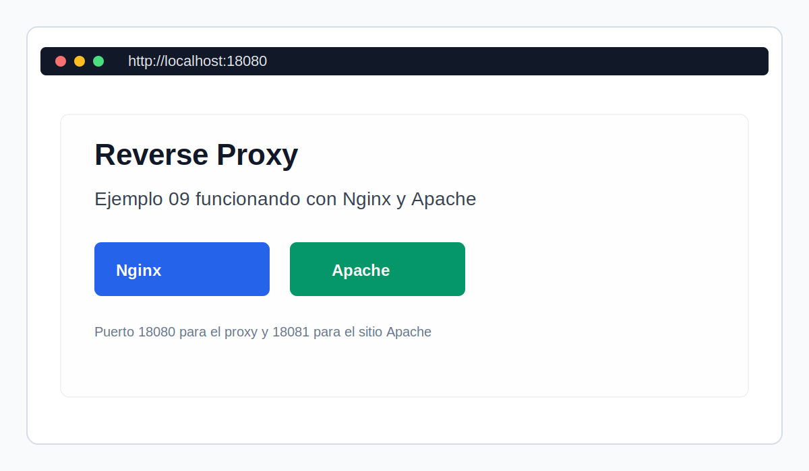

# DOCKER Tutorial

2DAW Tutorial de Docker para el desarrollo avanzado de código.

- [DOCKER Tutorial](#docker-tutorial)
  - [Acerca de](#acerca-de)
  - [Contenidos](#contenidos)
  - [Colaborar o nuevos contenidos o ejemplos](#colaborar-o-nuevos-contenidos-o-ejemplos)
    - [¿Cómo colaborar o corregir un cambio?](#cómo-colaborar-o-corregir-un-cambio)
  - [Autor](#autor)
    - [Contacto](#contacto)
  - [Licencia](#licencia)

## Acerca de

Tutorial de Docker de supervivencia a 2DAW. Ejemplos usados en clase.
Aprenderemos a manejar imagenes y contenedores y cómo aplicarlos para mejorar en el desarrollo de software.
Siempre con el objetivo de poder crear un entorno que podamos comaprtir y facilitar el despliegue de nuestro proyecto.

## Contenidos
- ¿Qué es Docker?
- Instalación
- Comandos básicos
- Ejecutando contenedores
- Dockerfile y nuestras imágenes
- Persistencia de datos
- Enlazando contenedores
- Docker Compose
- Docker Hub
- Despliegue con Docker Hub y GitHub
- Trucos y consejos
- Optimización
- Herramientas para Docker
- Docker Swarm

## Colaborar o nuevos contenidos o ejemplos

### ¿Cómo colaborar o corregir un cambio?

Para solicitar un cambio o ayudarme a pulir errores o a mejorar el contenido del curso y las transparencias lo podéis hacer de la siguiente manera:

- Siempre debéis hacer un fork del proyecto para trabajar con él.
- Lo primero es crear una rama con tu nombre de usuario de GitHub (vamos a ser ordenados)
- En la carpeta updates de tu rama añadís un fichero con vuestro nombre de GitHub para que en dicho fichero vayáis actualizando con las cosas que queráis aportar. Este fichero debe estar redactado usando [markdown](https://www.markdownguide.org/basic-syntax/).
  - Indicáis el número de la página de la presentación (por ejemplo página 34). Indicáis el texto y remarcáis la palabra o error detectado.
  - De la misma manera si queréis incorporar un gráfico o figura lo indicáis en qué página, o si es nueva donde iría y subís ese recurso en la carpeta updates.
  - También podéis aportar referencias, herramientas y cosas útiles que os han servidor para dominar Git y GitHub.
- Posteriormente hacéis un commit en vuestro repositorio y luego un pull request de los cambios indicados en tu rama y en la conversación me detallas algo de información y si el cambio se aprueba lo verás en la próxima versión Mira este [vídeo](https://www.youtube.com/watch?v=_M8oalUyz10) y este [otro](https://www.youtube.com/watch?v=QntLv5BjUr0).

Gracias por colaborar y entre todos mejoramos usando GitHub. Espero vuestros pull requests :smile:

## Autor

Codificado con :sparkling_heart: por [José Luis González Sánchez](https://twitter.com/joseluisgonsan)

### Contacto

  Cualquier cosa que necesites házmelo saber por si puedo ayudarte 💬.

     &nbsp;&nbsp;
     &nbsp;&nbsp;
      &nbsp;&nbsp;
    

## Actividades realizadas

Se han dejado preparados y adaptados los ejemplos solicitados para trabajar con Docker en clase:

- ejem01: imagen Apache + PHP 8.2 con editor Vim instalado dentro del contenedor, página editable desde el contenedor y desde VS Code mediante volumen.
- ejem02 y ejem03: scripts de arranque para WordPress y base de datos, actualizados para usar redes Docker modernas y versiones más recientes.
- ejem07: stack LEMP con PHP, Nginx, MariaDB y PhpMyAdmin funcionando mediante Docker Compose.
- ejem7: entorno completo con MySQL, PHPMyAdmin y PHP/Apache. El index.php conecta a MySQL, crea tabla usuarios automáticamente, inserta datos de ejemplo y los muestra con diseño moderno.
- ejem09: configuración de reverse proxy con dos sitios web estáticos lista para probar con Docker Compose.

### Uso rápido

- Para ejem01: ejecutar el script [ejemplos/ejem01/run.sh](ejemplos/ejem01/run.sh) y abrir http://localhost:5555.
- Para ejem07: entrar en [ejemplos/ejem07/docker](ejemplos/ejem07/docker) y ejecutar `docker compose up -d --build`.
- Para ejem7: entrar en [ejemplos/ejem7](ejemplos/ejem7) y ejecutar `docker compose up -d --build`. Acceder a:
  - http://localhost:8000 (App PHP)
  - http://localhost:8081 (PHPMyAdmin)
- Para ejem09: entrar en [ejemplos/ejem09](ejemplos/ejem09) y ejecutar `docker compose up -d --build`. Acceder a los sitios mediante:
  - http://site1.example.com
  - http://site2.example.com

### Capturas de ejemplo

#### Ejemplo 01 - Apache + PHP 8.2

**Consigna ejem01:** Edición dentro del contenedor de Docker y desde VS Code.
- Instalación de editor Vim dentro del contenedor
- Edición del archivo index.html con nombre, fecha y materia
- Conexión desde VS Code usando extensión Remote Explorer
- Actualización de PHP 7.0 a PHP 8.2 para compatibilidad

#### Ejemplo 02 - WordPress

**Consigna ejem02:** Script run.sh para despliegue de WordPress.
- Interpretación de comandos en script run.sh
- Ejecución manual en terminal de VS Code
- Despliegue de WordPress con Docker

#### Ejemplo 07 - Stack LEMP

**Consigna ejem07:** Stack LEMP con PHP, Nginx, MariaDB y PhpMyAdmin.
- Configuración completa mediante Docker Compose
- Implementación realizada el 16-06-2026

#### Ejemplo 7 - MySQL + PHPMyAdmin + PHP

**Consigna ejem7:** Entorno completo con MySQL, PHPMyAdmin y PHP/Apache.
- Conexión automática de PHP a MySQL
- Creación automática de tabla usuarios
- Inserción de datos de ejemplo
- Interfaz PHPMyAdmin para administración visual
- Diseño moderno en la aplicación PHP

#### Ejemplo 09 - Reverse Proxy

**Consigna ejem09:** Configuración de reverse proxy con dos sitios web estáticos.
- Implementación realizada el 16-06-2026
- Acceso mediante site1.example.com y site2.example.com

## Licencia

Este proyecto esta licenciado bajo licencia **MIT**, si desea saber más, visite el fichero
[LICENSE](./LICENSE) para su uso docente y educativo.
